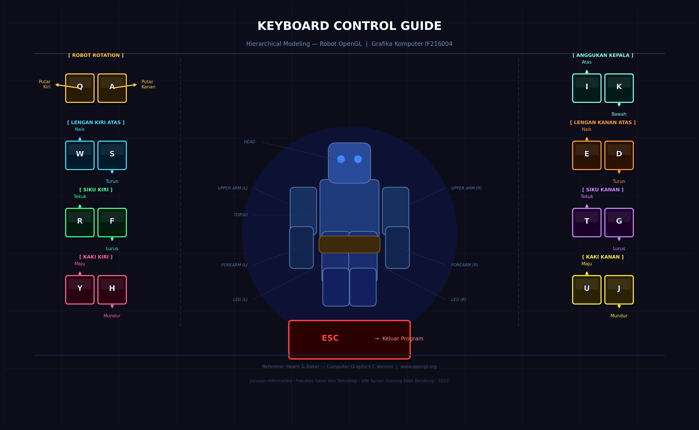

# 🤖 Hierarchical Modeling — Robot OpenGL

> Implementasi **Hierarchical Modeling** menggunakan **OpenGL + Matrix Stack** pada objek kompleks berupa Robot Sederhana.  
> Tugas Kelompok — Mata Kuliah Grafika Komputer (IF216004)  
> Jurusan Informatika · Fakultas Sains dan Teknologi · UIN Sunan Gunung Djati Bandung · 2022

---

## 🖼️ Preview



---

## 📁 Struktur Repository

```
├── hierarchical_robot.py     # Source code utama OpenGL
├── keyboard_guide.png        # Panduan kontrol keyboard
└── README.md
```

---

## 📖 Deskripsi

Program ini mengimplementasikan konsep **Hierarchical Modeling** pada grafika komputer menggunakan **PyOpenGL**. Objek kompleks yang dimodelkan adalah sebuah **Robot Sederhana** yang terdiri dari beberapa bagian tubuh yang saling terhubung secara hierarkis.

Setiap sendi robot merupakan titik pivot transformasi, sehingga rotasi pada bagian induk (*parent*) akan secara otomatis mempengaruhi bagian turunan (*child*) — inilah inti dari konsep **Matrix Stack** pada OpenGL.

---

## 🌲 Struktur Scene Graph (Hierarki Objek)

```
ROBOT  (root — rotasi seluruh tubuh)
├── HEAD        (anggukan kepala)
├── TORSO
│   ├── LEFT_ARM   ──→  LEFT_FOREARM   ──→  HAND
│   └── RIGHT_ARM  ──→  RIGHT_FOREARM  ──→  HAND
├── LEFT_LEG   ──→  LEFT_LOWER_LEG   ──→  SHOE
└── RIGHT_LEG  ──→  RIGHT_LOWER_LEG  ──→  SHOE
```

Setiap node dalam pohon hierarki diimplementasikan menggunakan pasangan `glPushMatrix()` / `glPopMatrix()`:

```python
glPushMatrix()                    # Simpan state matrix (titik sendi)
    glTranslatef(...)             # Geser ke posisi sendi
    glRotatef(angle, ...)         # Rotasi di titik pivot
    glTranslatef(...)             # Geser ke tengah segmen
    draw_upper_arm()              # Gambar bagian tubuh

    glPushMatrix()                # Child mewarisi transformasi parent
        glTranslatef(...)         # Geser ke siku
        glRotatef(elbow_angle, .) # Rotasi forearm sendiri
        draw_forearm()
    glPopMatrix()                 # Selesai forearm → kembali ke bahu

glPopMatrix()                     # Selesai arm → kembali ke root
```

---

## ⚙️ Requirements

```
Python >= 3.7
PyOpenGL
PyOpenGL_accelerate
```

Install dependencies:

```bash
pip install PyOpenGL PyOpenGL_accelerate
```

---

## 🚀 Cara Menjalankan

1. **Clone repository ini:**

```bash
git clone https://github.com/username/hierarchical-robot-opengl.git
cd hierarchical-robot-opengl
```

2. **Install dependencies:**

```bash
pip install PyOpenGL PyOpenGL_accelerate
```

3. **Jalankan program:**

```bash
python hierarchical_robot.py
```

---

## 🎮 Kontrol Keyboard

| Tombol | Bagian Tubuh | Fungsi |
|--------|-------------|--------|
| `Q` / `A` | Seluruh Robot | Putar kiri / kanan |
| `W` / `S` | Lengan Kiri Atas | Naik / turun |
| `E` / `D` | Lengan Kanan Atas | Naik / turun |
| `R` / `F` | Siku Kiri | Tekuk / lurus |
| `T` / `G` | Siku Kanan | Tekuk / lurus |
| `Y` / `H` | Kaki Kiri | Maju / mundur |
| `U` / `J` | Kaki Kanan | Maju / mundur |
| `I` / `K` | Kepala | Angguk atas / bawah |
| `ESC` | — | Keluar program |

---

## 💡 Konsep yang Diimplementasikan

**Matrix Stack** adalah mekanisme OpenGL untuk menyimpan dan memulihkan state matriks transformasi. Fungsi utama yang digunakan:

| Fungsi OpenGL | Kegunaan |
|---------------|---------|
| `glPushMatrix()` | Menyimpan matrix saat ini ke stack |
| `glPopMatrix()` | Memulihkan matrix dari stack |
| `glTranslatef()` | Translasi (menggeser posisi) |
| `glRotatef()` | Rotasi di titik pivot |
| `glScalef()` | Penskalaan objek |

Dengan pola Push–Transform–Draw–Pop ini, setiap bagian anak mewarisi transformasi induknya tanpa mempengaruhi bagian lain di luar hierarkinya.

---

## 📚 Referensi

1. Donald Hearn, M. Pauline Baker. *Computer Graphics C Version*. Prentice-Hall. 1997 *(Pustaka Utama)*
2. Max K. Agoston. *Computer Graphics and Geometric Modeling: Implementation and Algorithms*. Springer *(Pustaka Pendukung)*
3. Edhi Nugroho. *Grafika Komputer (Teori dan Praktek) menggunakan Delphi dan OpenGL* *(Pustaka Pendukung)*
4. Achmad Basuki & Nana Ramadijanti. 2016. *Grafika Komputer – Teori Dan Implementasi*. Penerbit ANDI: Yogyakarta *(Pustaka Pendukung)*
5. Pulung Nurtantio Andono & T. Sutoyo. *Konsep Grafika Komputer*. Penerbit ANDI: Yogyakarta *(Pustaka Pendukung)*
6. [www.opengl.org](https://www.opengl.org) *(Pustaka Utama)*
7. [MIT OCW — Computer Graphics Fall 2012, Lecture 04](https://ocw.mit.edu/courses/electrical-engineering-and-computer-science/6-837-computer-graphics-fall-2012/lecture-notes/MIT6_837F12_Lec04.pdf)

---

## 👥 Tim Pengembang

> Tugas Kelompok — Grafika Komputer IF216004  
> Jurusan Informatika · UIN Sunan Gunung Djati Bandung
